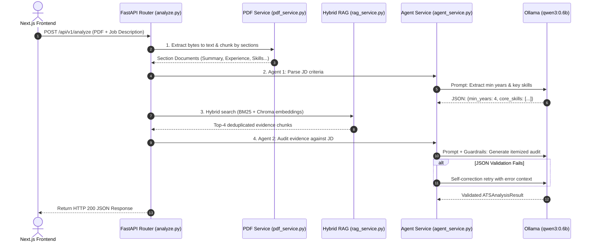

# ATS Resume AI Backend (FastAPI + Hybrid RAG)

High-performance, asynchronous FastAPI backend engine for Multi-Agent ATS resume analysis, hybrid semantic retrieval (BM25 + Chroma), Pydantic guardrail verification, and AI resume bullet tailoring.

---

## 🗺️ 1. End-to-End Request Lifecycle

When a job seeker submits their resume and target job description from the frontend, the request follows this end-to-end pipeline:



---

## 📁 2. File-by-File Architecture Breakdown

### 1. `app/main.py` — Application Entrypoint
- **FastAPI Instance**: Initializes `app = FastAPI(...)` with OpenAPI metadata.
- **CORS Middleware**: Configures Cross-Origin Resource Sharing for the Next.js frontend (`http://localhost:3000`).
- **Router Mounting**: Registers API endpoints under the `/api/v1` prefix.

### 2. `app/core/config.py` — Central Configuration
- Manages environment variables using `pydantic` and `dotenv`.
- Configures Ollama base URL (`http://localhost:11434`), LLM model (`qwen3:0.6b`), and embedding model (`qwen3-embedding:0.6b`).

### 3. `app/schemas/ats.py` — Pydantic Data Contracts
Defines strictly-typed data contracts:
- `SkillAudit`: Single skill audit (`skill_name`, `status` [Found/Missing/Partial], `evidence`).
- `JDRequirements`: Extracted constraints (`min_years_experience`, `core_skills`).
- `ATSAnalysisResult`: Full evaluation output (score 0–100%, experience match, itemized skill audit, strengths, critical gaps, recommendations, verdict).
- `TailorBulletRequest` & `TailoredBulletResponse`: Request/response schemas for AI resume bullet generation.

### 4. `app/services/pdf_service.py` — Section Ingestion & Chunking
- `extract_pdf_text_from_bytes`: Reads uploaded in-memory PDF bytes using `pypdf` without saving temporary files to disk.
- `create_section_chunks`: Uses **regex lookaheads** to split along natural resume sections (`Summary`, `Experience`, `Projects`, `Skills`, etc.), keeping complete work histories and projects intact as single documents.

### 5. `app/services/rag_service.py` — Hybrid RAG (Sparse + Dense)
Retrieves the most relevant resume sections using two complementary search mechanisms:
1. **BM25 Keyword Search (Sparse)**: Finds exact technical terms, acronyms, and tools (e.g., `FastAPI`, `PostgreSQL`, `AWS`).
2. **Chroma Vector Embeddings (Dense)**: Finds semantically similar meaning even if exact words differ.
3. **Deduplication**: Combines and deduplicates chunks to pass high-density context to the LLM.

### 6. `app/services/agent_service.py` — Multi-Agent & Guardrail Engine
- **Self-Correction Guardrails (`call_llm_with_guardrail`)**: Calls Ollama with JSON schema validation. If parsing or validation fails, it feeds the error back to the LLM and retries up to 3 times for autonomous self-healing.
- **Agent 1 (`agent_1_extract_jd_criteria`)**: Extracts structured experience thresholds and core competencies from the JD.
- **Agent 2 (`agent_2_synthesize_and_audit`)**: Evaluates retrieved resume context against JD criteria to produce itemized verdicts and evidence quotes.
- **Bullet Tailorer (`generate_tailored_bullets`)**: Generates tailored resume accomplishment bullets using Google's **XYZ Formula** (*"Accomplished [X], as measured by [Y], by doing [Z]"*).

### 7. `app/api/endpoints/analyze.py` — HTTP Route Controllers
- `GET /api/v1/health`: Checks backend health and Ollama connectivity.
- `POST /api/v1/analyze`: Coordinates the full multi-agent hybrid RAG audit pipeline.
- `POST /api/v1/tailor-bullets`: Generates customized bullets for any missing skill.

---

## 🚀 3. How to Run the Backend

### Prerequisites
- Python 3.10+
- Activated virtual environment (`.venv`)
- Ollama running locally (`ollama serve`) with `qwen3:0.6b` and `qwen3-embedding:0.6b`

### Run Command
From the project root:
```powershell
uvicorn app.main:app --app-dir backend --host 0.0.0.0 --port 8000 --reload
```

Or run the runner script:
```powershell
python backend/run.py
```

---

## 📚 4. API Endpoints Reference

| Method | Endpoint | Description |
| :--- | :--- | :--- |
| `GET` | `/` | Root service status and API links |
| `GET` | `/api/v1/health` | Health check & Ollama model connectivity |
| `POST` | `/api/v1/analyze` | Multi-Agent ATS audit (multipart PDF + JD text) |
| `POST` | `/api/v1/tailor-bullets` | AI Google XYZ formula resume bullet generator |
| `GET` | `/docs` | Interactive Swagger UI API documentation |

