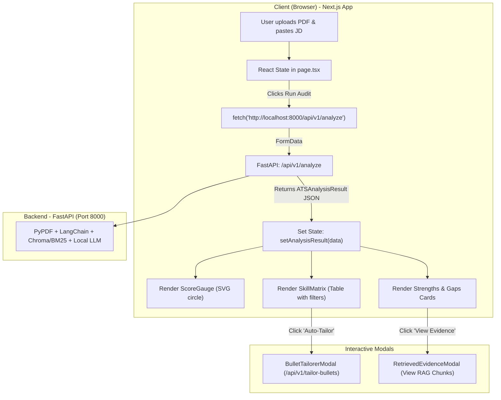

# TalentFit ATS - Next.js Frontend

A modern, responsive Next.js (App Router) web application for the TalentFit AI ATS Resume Analyzer. The frontend communicates asynchronously with a FastAPI backend to run hybrid RAG audits, visualize keyword gaps, and tailor resume bullet points.

---

## 1. High-Level Architecture & Data Flow

Unlike monolithic Streamlit apps, Next.js runs as a **Single Page Application (SPA)** in the user's browser, maintaining a decoupled API connection to FastAPI.



---

## 2. Directory Structure

```text
frontend/
├── src/
│   ├── app/
│   │   ├── layout.tsx         # Root wrapper (Fonts, global styles, HTML structure)
│   │   ├── globals.css        # Tailwind CSS styling and theme definitions
│   │   └── page.tsx           # Main App / Dashboard (Holds all core state & logic)
│   ├── components/
│   │   ├── Navbar.tsx                 # Header with live FastAPI health check
│   │   ├── ScoreGauge.tsx             # Animated circular ATS match score ring
│   │   ├── SkillMatrix.tsx            # Filterable table of found/missing keywords
│   │   ├── BulletTailorerModal.tsx    # Modal to rewrite bullets using XYZ formula
│   │   └── RetrievedEvidenceModal.tsx # Modal to inspect raw RAG text chunks
│   ├── types/
│   │   └── ats.ts             # TypeScript interfaces mirroring FastAPI Pydantic schemas
│   └── data/
│       └── jobPresets.ts      # Sample Job Descriptions (Software Eng, Data Scientist, PM)
├── package.json
└── README.md
```

---

## 3. File-by-File Breakdown

### `src/types/ats.ts` (Data Contracts)
Defines TypeScript interfaces to enforce type safety when receiving responses from FastAPI:
* `SkillAuditItem`: Represents an individual skill (`skill`, `status: 'FOUND' | 'PARTIAL' | 'MISSING'`, `importance`, `evidence`).
* `ATSAnalysisResult`: Mirrors the backend's Pydantic response schema (`match_percentage`, `summary_verdict`, `strengths`, `critical_gaps`, `skill_audit`, etc.).
* `AnalyzeResponse`: The top-level response wrapper (`success`, `data`, `retrieved_chunks`, `error`).

---

### `src/app/layout.tsx` & `src/app/globals.css` (Root & Styling)
* **`layout.tsx`**: Wraps all pages. Configures Google Geist fonts and root HTML body properties.
* **`globals.css`**: Tailwind CSS v4 setup with inline color variable declarations and theme utilities.

---

### `src/app/page.tsx` (Dashboard State & Controller)
Marked with `'use client';` so it executes in the user's browser:
* **State Management**:
  * `file`: Holds the uploaded PDF resume file.
  * `jobDescription`: The target JD text string.
  * `loading`: Toggles the visual step-by-step pipeline loading status.
  * `analysisResult`: Holds the structured `ATSAnalysisResult` object.
  * `tailorModalSkill`: Controls the active skill in the bullet tailoring modal.
  * `evidenceModalOpen`: Toggles the RAG raw evidence inspector modal.
* **`handleRunAudit()`**:
  1. Packages the PDF file and Job Description into a `FormData` object.
  2. Dispatches `POST http://localhost:8000/api/v1/analyze`.
  3. Updates state with the returned JSON, triggering re-renders of the gauge and matrix components.

---

### `src/components/Navbar.tsx` (Live Health Check)
* Executes a `useEffect` hook upon mounting to query `GET http://localhost:8000/api/v1/health`.
* Displays a live status badge:
  * 🟢 **Online**: FastAPI is reachable.
  * 🔴 **Offline**: FastAPI is unreachable or down.

---

### `src/components/ScoreGauge.tsx` (Match Score Gauge)
* Renders an SVG circular ring representing match percentage.
* Uses SVG stroke math: `(score / 100) * 283`.
* Color-coded thresholds:
  * **Green**: $\ge 80\%$
  * **Amber**: $60\% - 79\%$
  * **Red**: $< 60\%$

---

### `src/components/SkillMatrix.tsx` (Keyword & Skill Audit Table)
* Renders a filterable table of skills identified in the Job Description.
* Tab filtering: **All**, **Found**, or **Missing**.
* For missing or partial skills, provides an **"Auto-Tailor Bullet"** button to quickly generate bullet points addressing the gap.

---

### `src/components/BulletTailorerModal.tsx` (AI Bullet Tailor)
* Allows the user to paste an existing bullet point from their resume.
* Dispatches `POST http://localhost:8000/api/v1/tailor-bullets` with the draft bullet and target skill.
* Displays the optimized bullet point following Google's XYZ formula (*"Accomplished [X] as measured by [Y], by doing [Z]"*) with a one-click copy button.

---

### `src/components/RetrievedEvidenceModal.tsx` (RAG Transparency Viewer)
* Displays the exact text chunks retrieved from the PDF resume via hybrid BM25 and Chroma semantic search.
* Helps verify what context the LLM used when computing the score.

---

### `src/data/jobPresets.ts` (Quick Test Data)
Contains predefined job descriptions (Software Engineer, Data Scientist, Product Manager) for one-click testing without manual copying/pasting.

---

## 4. API Endpoints Used

| Action | Frontend Trigger | Backend Route | Method | Payload / Response |
| :--- | :--- | :--- | :--- | :--- |
| **Backend Health** | Navbar Mount | `/api/v1/health` | `GET` | `{ "status": "online" }` |
| **Full ATS Audit** | "Run ATS Audit" Button | `/api/v1/analyze` | `POST` | `multipart/form-data` &rarr; `ATSAnalysisResult` |
| **Tailor Bullet** | Modal "Apply XYZ Formula" | `/api/v1/tailor-bullets` | `POST` | `application/json` &rarr; `{ tailored_bullet }` |

---

## 5. Running the Frontend

Ensure your FastAPI backend is running on `http://localhost:8000`, then start the Next.js dev server:

```bash
cd frontend
npm run dev
```

Open [http://localhost:3000](http://localhost:3000) in your browser.
